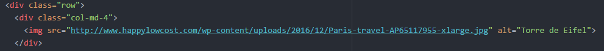
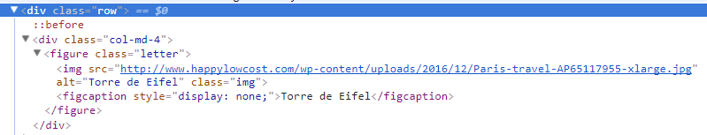

# Cardify

***
## Objetivo

Implementar un plugin de jQuery que dado un contenedor debe buscar todas las
imágenes que encuentre dentro del contenedor y reemplazarlas por un nuevo
elemento `<figure>` que contenga la imagen (``) además de una etiqueta `<figcaption>`con el texto del atributo `alt` de la imagen.Asimismo se le adiciona el efecto hover a cada imagen.


## Integrantes

* Melissa Yauri
* Silvia Fuentes

## Herramientas

* `Jquery`: Es una librería de JavaScript que simplifica la tarea de programar en JavaScript y permite agregar interactividad a un sitio web.

* `Babel`(transpilador): Herramienta  que nos permite convertir nuestro código de JavaScript ES6 en código de ES5.

* `Html`, `Css`, `javascript`.

## Procedimiento de trabajo

1.- Para la creación de la librería, se procede con la inicialización del comando `npm.init`, para la creación del objeto JSON.
    En este archivo debe escribirse el siguiente comando:
    `"build": "babel --presets env src -d public/js"`,
    con el fin de que se realize la sincronización de babel con las carpetas donde se ejecutará los archivos en ES5.

2.- Luego se ejecuta el comando `npm install --save-dev babel-cli babel-preset-env`, para instalar babel.
    Esto producirá el archivo `package-lock.json` y `node_modules`.

3.- Crear el archivo `.babelrc` y incorporar lo siguiente.
    { "presets": ["env"] }

4.- Y también crear el archivo `.gitignore`, para que git, ciertos archivos los ignore y no los subas como por ejemplo el node_modules. En este archivo se debe de escribir los archivos que no se desean subir. Se incorpora lo siguiente:
    node_modules/
    .DS_Store
    Thumbs.db

5.- En el archivo `app.js` ubicados en la carpeta src, se procede con llamar al plugin con la función
    $('#container-img').cardify();

6.- En el archivo `index.js` ubicados en la carpeta src se encuentra la ejecución del plugin `Cardify`.

7.- Finalmente para hacer la conversión de ES6 a ES5, se ejecuta en el `comand node.js`, lo siguiente `npm install --save-dev babel-cli` y luego `npm run bluid`, con ello convertiremos a ES5, que se ubica en la carpeta public.


***
# Documentación

## ¿Qué es Cardify?

Cardify es una herramienta que le permitirá mostrar de manera dinamica, el texto equivalente (alt), de cada imagen, dentro de un contenedor específico.


## Funcionalidad
Primero se tiene lo siguiente



Utilizando Cardify, automaticamente:
1. Las imágenes son envueltas por la etiqueta `figure`
2. Luego en esa etiqueta se le adiciona la etiqueta `figcaption`, que contiene el atributo `alt`, de la imagen.



3. Finalmente se realiza un efecto `hover`, para que aparezca el atributo `alt`, que se encuentra en la etiqueta `figure`


## Guía de uso

### **Instalación**
 
Para hacer uso de **Cardify** debemos vincular los siguientes archivos.

    1. Descargar Cardify o clonarlo desde GitHub.

### **Inicialización**
    2. Vincular css en el archivo HTML para el funcionamiento correcto del plugin.
```html
<!-- Vinculación de archivo css -->
<link rel="stylesheet" href="public/css/main.css">
```
    3. Vincular jquery3.2.1 en el archivo HTML.
```html
<!-- Vinculación de jquery 3.2.1 -->
<script src="https://ajax.googleapis.com/ajax/libs/jquery/3.2.1/jquery.min.js"></script>
```

    4. Vincular 'index.js' que aplicará la funcionalidad del plugin.

```html
<!-- Vinculación del archivo JS -->
<script src="src/index.js"></script>
```

### **Uso**

    5. Agregar la siguiente línea de código al archivo Javascript del proyecto. Nombrar el ID a utilizar en el contenedor de imagenes o usar "container-img".

```js
//container-cardify es el selector del contenedor 
$('#container-img').cardify();
```

Ejemplo de uso en HTML:

```html
 <div id = "container-img">      
     
      
 </div>
```
    * Es necesario que las imagenes en el archivo html se encuentren dentro de un contenedor.


